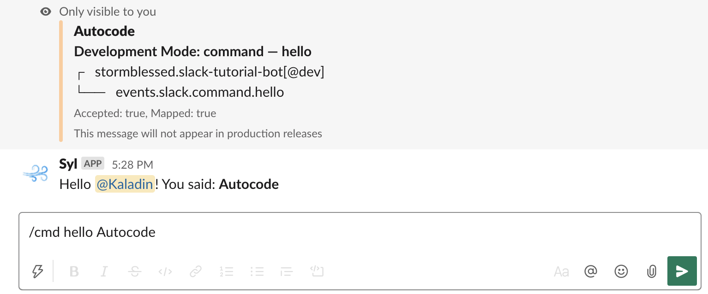

# Basic Autocode Slack Bot

### Deploy Now

This is a basic, fully customizable example Slack Bot that you can install into your Slack workspace in just a few clicks by deploying it to [Autocode](https://autocode.com). Right out of the box, your bot will:

1. Respond to a [Slack slash command](https://api.slack.com/interactivity/slash-commands) called `hello` by sending a reply message from the bot containing whatever text follows the command.
1. Send a friendly welcome message to users who join a new channel in your Slack workspace.

This behavior is completely customizable by editing the bot code. The only things you'll need are an [Autocode account](https://autocode.com) and a Slack workspace!

## Hello Command

Once installed, typing `/cmd hello <text>` will trigger `/functions/events/slack/command/hello.js` and provide an output that look like this:

## Member Joined Channel Handler

When a member joins a public channel, your bot will respond to the resulting [member_joined_channel](https://api.slack.com/events/member_joined_channel) event from Slack by running `/functions/events/slack/member_joined_channel.js`. This will generate a message like this:

## Deploying This Slack Bot

You can deploy this Slack Bot to Autocode by clicking the button below:

You'll be asked to log in and choose a name for your project. Do so, and the project editor will open. Open `functions/events/slack/member_joined_channel.js`, and you'll see a bouncing red button on the bottom of your screen.

Click it and follow the instructions under **Install Autocode App** to link your Slack workspace. Finally, hit the blue **Deploy** button in the bottom right corner to push your project live. That's it, you're done!

**Note:** Creating and linking your own custom Slack app rather than the official Autocode app will allow you to trigger this command as `/hello` (without the `/cmd`), but is a more complex process –– we recommend starting simple and swapping in the custom app later if desired.

## Thank You!

Please check out [Autocode](https://autocode.com) or follow us on Twitter, [@AutocodeHQ](https://twitter.com/AutocodeHQ).